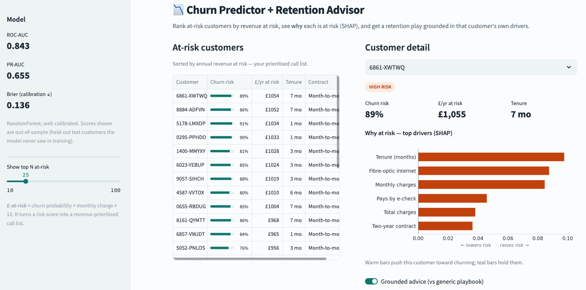
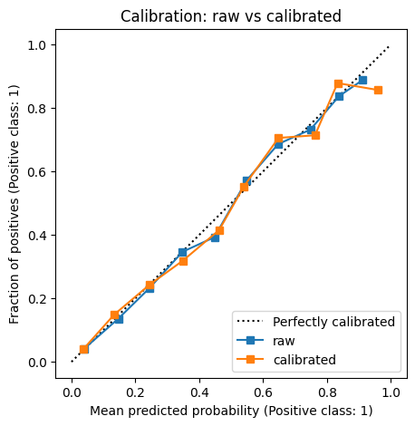
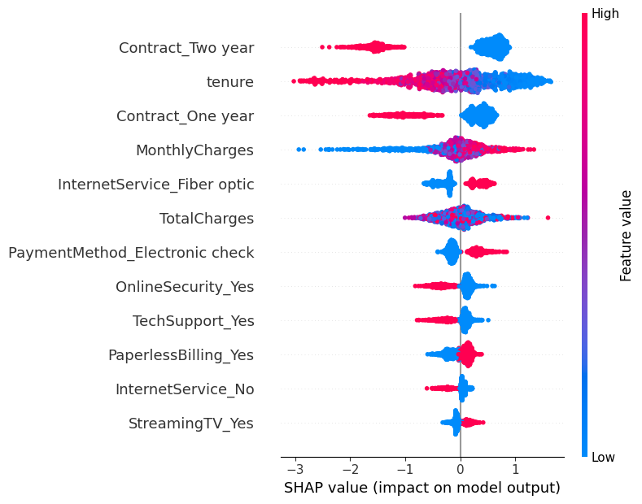
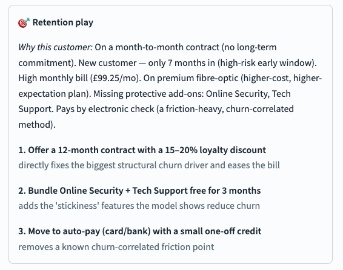

# Churn Predictor + Retention Advisor

> Predicts which customers are about to churn **and** — for each one — turns the model's own reasoning into a specific, grounded retention action, prioritised by the revenue at risk.

A churn model on its own is a data-science exercise. This is built like a tool a **Customer Success team could actually use**: it ranks at-risk customers by **£-at-risk**, explains *why* each is at risk (SHAP), and proposes a concrete, evidence-based retention play — shipped as an interactive Streamlit app.

**🔗 Live demo:** **https://churn-retention-advisor.streamlit.app**



---

## Why this is more than a churn notebook
1. **Grounded advice, not vibes.** Each retention recommendation is built from that customer's actual SHAP drivers — traceable, not generic ("offer a discount 🙂").
2. **It ships.** A deployed, clickable Streamlit app, not a notebook only the author can run.
3. **It speaks money.** Every prediction is tied to **£-at-risk** (churn probability × customer value), so the output is a prioritised, commercial action list.

---

## Approach
1. **Data & cleaning** — [Telco Customer Churn](https://www.kaggle.com/datasets/blastchar/telco-customer-churn) (IBM sample, 7,043 customers, ~26.5% churn). Fixed the `TotalCharges` text/blank quirk, dropped the ID, one-hot encoded — with an `assert`-based **data-quality gate** so cleaning is provable, not assumed.
2. **Model comparison** — benchmarked four models, ranked by **PR-AUC + calibration** (not accuracy).
3. **Calibration** — found `class_weight='balanced'` made probabilities over-confident; removing it left **RandomForest well-calibrated**, so the £-at-risk numbers are trustworthy.
4. **Explainability** — per-customer **SHAP** drivers (the "why").
5. **Grounded retention layer** — converts each customer's drivers into a specific play (offer + reason), prioritised by £-at-risk.

---

## Results

| Model | ROC-AUC | PR-AUC | Brier ↓ | Recall@10% |
|---|--:|--:|--:|--:|
| **RandomForest** ✅ | **0.843** | **0.655** | **0.136** | 0.289 |
| Logistic Regression | 0.843 | 0.636 | 0.138 | 0.283 |
| LightGBM | 0.831 | 0.624 | 0.143 | 0.278 |
| HistGradientBoosting | 0.829 | 0.628 | 0.144 | 0.273 |

*ROC-AUC ≈ 0.84 matches the known ceiling for this dataset — chasing higher usually means leakage. **Top-decile precision ≈ 77%**: of the highest-risk customers flagged, ~3 in 4 are genuine churners.*

### Calibration — probabilities you can trust


### Per-customer "why" (SHAP)


The drivers are textbook-sensible (contract type, tenure, monthly charges, fibre, electronic-check payment, missing security/support), which confirms the model is learning real signal.

### Key insight — one at-risk segment, one playbook
Every top-risk customer shares the **same signature: fibre-optic + month-to-month + electronic-check + missing security/support add-ons.** That's not many individual problems — it's **one high-value churn segment** with one playbook: *annual-contract offer + free security/support bundle + auto-pay nudge.* (Worked examples in [`results.md`](results.md).)

---

## How to run locally
```bash
python -m venv .venv && source .venv/bin/activate
pip install -r requirements.txt
streamlit run src/app.py        # the Telco CSV is included in data/
```
Or explore the analysis in `notebooks/churn_advisor.ipynb` (runs on Colab; no API key needed).

## Tech stack
Python · pandas · scikit-learn (RandomForest) · SHAP · Streamlit (deployed on Streamlit Community Cloud)

## Project structure
```
notebooks/churn_advisor.ipynb   # analysis: data → model → SHAP → plays
src/app.py                      # the Streamlit app
results.md                      # model results + worked retention plays
data/                           # Telco dataset (redistributable IBM sample)
images/                         # plots used in this README
```

## The retention layer (a note on the LLM)
The deployed app uses a **deterministic, driver-grounded generator** — every recommendation maps to a real SHAP driver, so it can't hallucinate and needs no API key. It's designed to drop in a live LLM (Anthropic API, with a no-hallucination guardrail) for richer phrasing — see the optional cell in the notebook.



*Each recommendation traces back to one of this customer's actual drivers — the "why" is shown alongside the "what", and the app's toggle contrasts this with a generic playbook.*

## Limitations & ethical use
- Single **public dataset**; no real customer PII. Results are illustrative.
- **Gender is deliberately not used to drive actions** — retention offers key off behavioural/contract features only.
- Retention actions are **evidence-aligned but not yet A/B-tested**; treat as decision support, not automation.
- No temporal (out-of-time) validation — a real deployment would validate on future data and monitor for drift.

## Production next steps
Scheduled **retraining + drift monitoring**, an **A/B test** of the retention playbook vs a control, a feedback loop from CS outcomes, and (if automated) a human-in-the-loop guardrail on generated copy.

## License
All rights reserved — published publicly for viewing, not for reuse. See [LICENSE](LICENSE).
